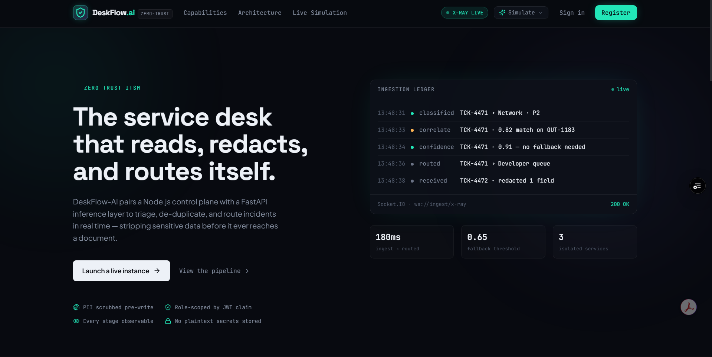
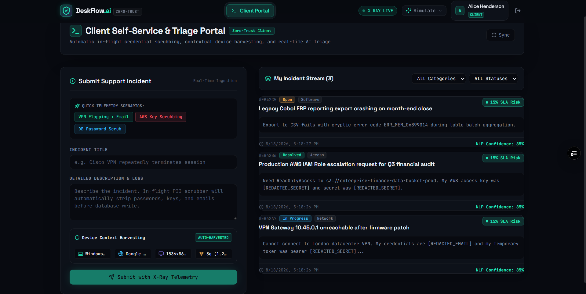
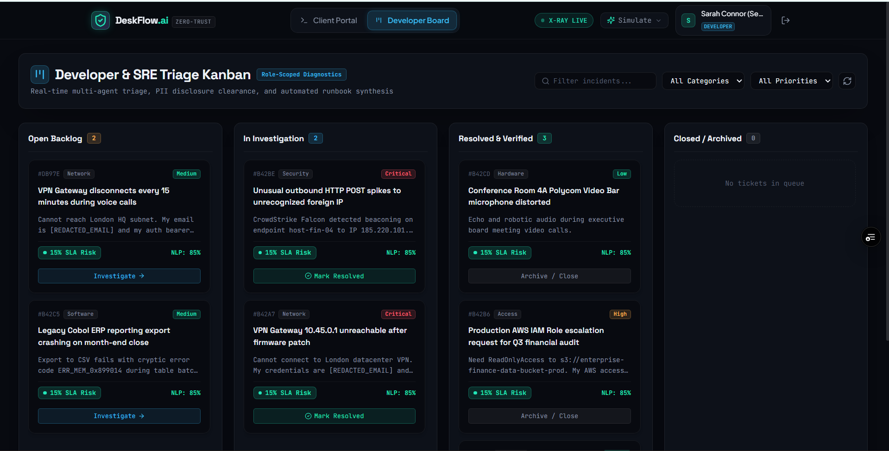
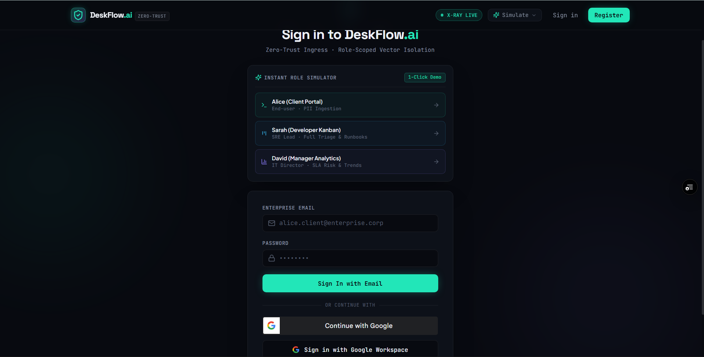
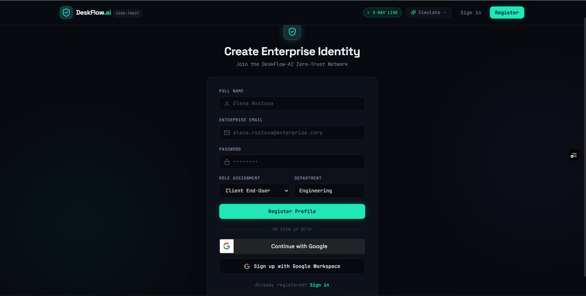

<div align="center">

# 🛡️ DeskFlow-AI (ResolveDesk-AI)
### Enterprise Zero-Trust IT Service Management & Real-Time Intelligence Platform

**A self-triage service desk that reads a ticket, scrubs the secrets out of it, and routes it — before a human ever sees it.**

[](https://resolve-desk-ai.vercel.app)
[](https://resolve-desk-ai.vercel.app)
[](https://resolve-desk-ai.vercel.app)
[](https://resolve-desk-ai.vercel.app)
[](https://resolve-desk-ai.vercel.app)
[](https://resolvedesk-ai.onrender.com)

**[🌐 Live Production Web App](https://resolve-desk-ai.vercel.app)** &nbsp;•&nbsp; **[⚙️ Live API Health](https://resolvedesk-ai.onrender.com/health)** &nbsp;•&nbsp; **[📖 Engineering Retrospective](./PROBLEMS_FACED.md)**

<br><br>



</div>

<br>

## 💡 Why This Project Exists

Every enterprise service desk quietly bleeds money and risk in the same three places:

| The Problem | The Cost |
|---|---|
| 🔓 **Plaintext secrets in tickets** | Users paste API keys, passwords, and PII directly into support tickets — where they sit, unencrypted, forever. |
| 🌀 **Duplication storms** | One outage → 40 identical tickets → triage engineers drowning in noise instead of fixing the outage. |
| 🐌 **Manual routing latency** | Incidents wait hours in an unsorted queue before a human even reads them, let alone assigns them. |

**DeskFlow-AI closes all three gaps automatically**, in the time it takes a ticket to hit the database:

- 🧼 **Redacts secrets in-flight** — before a single byte reaches storage
- 🧭 **Flags duplicates in real time** — as the user is still typing
- ⚡ **Classifies and prioritizes in under 180ms**, escalating to an agentic runbook when confidence is low
- 📡 **Streams its own reasoning** — every pipeline stage, live, over WebSockets
- 🔐 **Enforces role-based data access at the database layer**, not just the UI
- 🌓 **Universal Dual Theme Support** — seamless toggle between Dark Cyber and Light Enterprise modes

<br>

## 🏛️ System Architecture

A three-tier distributed system where each layer has exactly one job:

```
┌─────────────────────────────────────────────────────────────────────────┐
│                    REACT + VITE FRONTEND (PORT 5173)                    │
│    Client Portal   │   Developer Kanban   │   Manager SOC2 Dashboard    │
│                         Google OAuth 2.0 · JWT                          │
└────────────────────────────┬────────────────────────────┬───────────────┘
                             │ Axios / REST + JWT         │ Socket.IO Stream
                             ▼                            ▼
┌─────────────────────────────────────────────────────────────────────────┐
│               NODE.JS + EXPRESS CONTROL PLANE (PORT 5000)               │
│  • JWT auth & Google OAuth token verification                           │
│  • Zero-trust role-based MongoDB projections                            │
│  • Socket.IO multi-room telemetry broadcasting                          │
│  • In-memory NLP triage fallback + Google Gemini 1.5 SRE bridge         │
└────────────────────────────┬────────────────────────────────────────────┘
                             │ HTTP (< 1.5s timeout)
                             ▼
┌─────────────────────────────────────────────────────────────────────────┐
│               PYTHON FASTAPI AI MICROSERVICE (PORT 8000)                │
│  • spaCy NER + regex PII redaction pipeline                             │
│  • TF-IDF cosine similarity semantic duplicate detector                 │
│  • Multi-class incident classification engine                           │
│  • Autonomous agentic runbook synthesis                                 │
└─────────────────────────────────────────────────────────────────────────┘
```

<br>

## 👥 User Personas & Workflows

DeskFlow-AI is structured around three distinct enterprise roles:

### 1. Client / End-User View — `/client`
*Target Audience: Employees, non-technical staff needing IT assistance.*



1. **Context auto-harvesting** — captures browser, OS, screen resolution, and network type without manual input.
2. **In-flight PII preview** — client-side regex visualizes secrets being scrubbed in real time as the user types.
3. **Outage duplicate warning** — alerts the user if their issue matches an active incident via vector cosine similarity.
4. **WebSocket X-Ray modal** — streams the 5-stage AI ingestion pipeline live on submit.

---

### 2. Developer / SRE Engineer View — `/developer`
*Target Audience: IT Engineers, System Administrators, DevOps Leads.*



1. **Interactive Kanban board** — `Open Backlog` → `In Investigation` → `Resolved & Verified` → `Closed / Archived`.
2. **Dual-payload inspection** — toggle between sanitized and raw diagnostic payloads (role-restricted clearance).
3. **Agentic runbook SOPs** — step-by-step remediation procedures pulled automatically when AI confidence is `< 0.65`.
4. **Internal investigation notes** — timestamped engineering diagnosis thread.

---

### 3. IT Director / Manager View — `/manager`
*Target Audience: IT Directors, SOC2 Compliance Officers, Service Delivery Managers.*

1. **Executive KPI dashboard** — SLA compliance rate, average model confidence, total PII entities scrubbed, live queue backlog.
2. **SLA breach-risk radar** — a mode-aware Recharts visualization forecasting which incidents are about to blow their deadline.
3. **Category volume breakdown** — `Hardware · Network · Access · Software · Security`.
4. **PII redaction audit trail** — a compliance-ready log of every credential type scrubbed and when.

<br>

## ⚙️ The 8 Novel Enterprise Features

| # | Feature | What It Does | Where It Lives |
|---|---|---|---|
| 1 | **In-Flight PII Redaction** | Strips passwords, API tokens, AWS keys, and emails *before* the database write | `ai-engine/pipelines/pii_redactor.py` |
| 2 | **NLP Triage Engine** | Classifies category + priority with a live confidence score | `ai-engine/pipelines/nlp_triage.py` |
| 3 | **Semantic Duplicate Detection** | TF-IDF + cosine similarity, flags outages as the user types | `frontend/src/components/DuplicateWarningBanner.jsx` |
| 4 | **Role-Enforced Vector Security** | JWT claims baked into DB projections — clients physically cannot query dev fields | `backend/routes/ticketRoutes.js` |
| 5 | **Contextual Indexing** | OS/browser/network diagnostics harvested and attached automatically | `frontend/src/services/deviceContext.js` |
| 6 | **Agentic Runbook Fallback** | Confidence `< 0.65` triggers automated runbook retrieval and SOP drafting | `ai-engine/pipelines/agentic_fallback.py` |
| 7 | **WebSocket "X-Ray" Telemetry** | Streams the 5-stage ingestion pipeline to the client live | `frontend/src/components/XRayTelemetryModal.jsx` |
| 8 | **SLA Breach Predictor** | Forecasts breach probability (0–100) from priority + queue depth | `frontend/src/components/SLABadge.jsx` |

<br>

## 🔒 Security Architecture & Real Google OAuth 2.0

<div align="center">
  
  
</div>

DeskFlow-AI implements multi-layered enterprise security:
- **Google Identity Services (GIS) & OAuth 2.0:** Official Google popup authentication. Tokens are cryptographically verified server-side against Google's public OAuth verification endpoints (`https://oauth2.googleapis.com/tokeninfo`).
- **JWT Token Expiration & Role Claims:** Standard 30-day cryptographically signed tokens containing role permissions (`client`, `developer`, `manager`).
- **CORS & Zero-Trust Origin Isolation:** Strict cross-origin communication policies between Vercel Edge frontend and Render backend.
- **Universal Dual Theme Engine:** 1-click seamless toggle between Dark Cyber and Light Enterprise modes with persistent preferences.

<br>

## 📡 API & WebSocket Reference

<details>
<summary><strong>Authentication — <code>/api/auth</code></strong></summary>

| Method | Endpoint | Description |
|---|---|---|
| `POST` | `/api/auth/register` | Create a new identity |
| `POST` | `/api/auth/login` | Email + password authentication |
| `POST` | `/api/auth/google` | Verified Google OAuth token exchange |
| `GET` | `/api/auth/me` | Current authenticated user profile |
| `GET` | `/api/auth/demo-users` | Pre-seeded demo accounts |

</details>

<details>
<summary><strong>Tickets & Triage — <code>/api/tickets</code></strong></summary>

| Method | Endpoint | Description |
|---|---|---|
| `GET` | `/api/tickets` | Role-scoped incident list |
| `POST` | `/api/tickets` | Ingest a new incident, trigger PII scrub + X-Ray telemetry |
| `POST` | `/api/tickets/check-duplicates` | Real-time vector similarity search |
| `PATCH` | `/api/tickets/:id/status` | Transition status (`Open` → `In Progress` → `Resolved` → `Closed`) |
| `POST` | `/api/tickets/:id/notes` | Append an internal diagnostic note |

</details>

<details>
<summary><strong>Analytics — <code>/api/analytics</code></strong></summary>

| Method | Endpoint | Description |
|---|---|---|
| `GET` | `/api/analytics/overview` | Executive KPI summary, SLA radar data, PII audit metrics |

</details>

<br>

## 🚀 Local Quick Start

### Prerequisites
`Node.js v18+` · `npm` · `Python 3.10+` · `pip` · `MongoDB` (local or Atlas)

```bash
# 1. Backend — Express + Socket.IO (Port 5000)
cd backend
npm install
npm run seed      # Seeds initial demo accounts
npm run dev

# 2. AI Microservice — FastAPI (Port 8000)
cd ai-engine
pip install -r requirements.txt
python main.py

# 3. Frontend — React + Vite (Port 5173)
cd frontend
npm install
npm run dev
```

<br>

## 👤 Pre-Seeded Demo Accounts (1-Click Login)

| Role | Name | Enterprise Email | Password | Access |
|---|---|---|---|---|
| **Client** | Alice Henderson | `alice.client@enterprise.corp` | `password123` | Self-Service Ingest, Real-Time X-Ray |
| **Developer** | Sarah Connor (SRE) | `dev.sarah@enterprise.corp` | `password123` | Kanban Board, Dual Payload View, Runbooks |
| **Manager** | David Vance (IT Director) | `manager.david@enterprise.corp` | `password123` | Executive Analytics, SLA Radar, PII Audit |

<br>

<div align="center">
  <p>© 2026 DeskFlow-AI Engineering. All enterprise rights reserved.</p>
</div>
